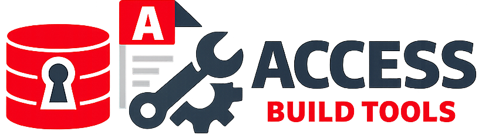

# Access Build Tools



# 📦 Access Build Tools

A PowerShell module for **building Microsoft Access databases from source**, e.g. for usage in automated CI/CD workflows.

It is designed to support a full build pipeline including versioning, publishing, testing, and ACCDE compilation.

A substantial part of this module is built on Adam Waller's [MS Access VCS add‑in](https://github.com/joyfullservice/msaccess-vcs-addin). Many thanks for making this tool available.

If this module does not meet your needs, consider checking out [msaccess-vcs-build](https://github.com/AccessCodeLib/msaccess-vcs-build). It is another PowerShell‑based build script with a different feature set.

---

## ⚙️ Requirements

To use the build cmdlets, the following components must be installed on the system:

### **Microsoft Access**

### **[JoyfullService/ms-access-vcs Add-In](https://github.com/joyfullservice/msaccess-vcs-addin)** [v5.1-alpha or newer](https://github.com/lagwagon667/msaccess-vcs-addin/releases/download/v5.1.0-alpha-1/Version.Control.zip)

(used for exporting/importing Access objects as source files)

If the MS‑Access‑VCS add‑in is not already present, the module will automatically download and install it.

> **Note:** At the moment, the add‑in is downloaded from an unofficial source because the latest official release does not yet include the required automation changes. Once these updates are available in an official build, the download URL will be switched accordingly. To avoid automatic retrieval of unofficial builds, you can build the add‑in yourself from the dev branch and install it manually on your build runner.

> **Note:** If you are using MS‑Access‑VCS add‑in version 5.0.1 or earlier, the build will fail because these versions do not include the functions required for automation.

### **[GitVersion](https://gitversion.net)**

(Required only when version numbers should be added during the build)

GitVersion will be looked for in `%LOCALAPPDATA%\GitVersion\6.8.2\gitversion.exe`. If it isn’t found, the module automatically downloads it.

---

## 📥 Installation

You can install the module in the following way:

### 🔹 Local Installation (recommended for development)

Place the `AccessBuildTools` folder into one of your PowerShell module paths, e.g.:

```
$env:USERPROFILE\Documents\PowerShell\Modules\
```

Then either import it:

```powershell
Import-Module AccessBuildTools
```

or if your host supports autoloading just start using the cmdlets.

---

## 🚀 Cmdlets

- **Build-Accdb** — Creates an Access database from source files.  
  Optionally generates a version number and injects it into the database during the build process.

- **Publish-Accdb** — Embeds external references directly into the database and injects startup code that unpacks these references before Access launches the application.  
  This ensures the database runs correctly on machines where the referenced libraries are not installed.

- **Invoke-UnitTests** — Executes automated tests defined in the Access project to validate functionality during CI/CD or local development.

- **Convert-ToAccde** — Produces a compiled ACCDE file for deployment, ensuring code protection and stable runtime behavior.

- **Get-References** — Outputs all **not-builtin** references used by a given Access database.  
  This utility helps determine which references should be embedded when running the `Publish-Accdb` cmdlet.

For further information see the builtin help of the CmdLets (e.g. `help Build-Accdb`)

## 🚫 Startup blocking prevention for automated Access builds

Preventing blocking caused by startup forms or the AutoExec macro requires disabling any automatic UI that would halt execution during a headless build. When Access opens a database that launches a modal startup form, the process will pause indefinitely until that form is closed — which is impossible in automated or invisible execution. To avoid this, the build pipeline must prohibit all autostart behavior. This is currently handled through the environment variable `ACCESS_NO_AUTOEXEC`, which is set to `1` during automation. Any database that normally opens a modal dialog at startup must check that environment variable and abort early when `ACCESS_NO_AUTOEXEC=1`, preventing the modal dialog from opening and ensuring the build process continues without blocking.

## 📦 Typical Workflows

Because **Publish-Accdb modifies the Access DB**, it cannot be combined with ACCDE compilation.  
A build pipeline therefore splits into two valid paths:

### 🔧 Workflow 1 — Build → Test → Publish

Use this workflow when you want an **ACCDB with embedded references** that can run on machines without the external libraries installed.

1. **Build-Accdb**
2. **Invoke-UnitTests**
3. **Publish-Accdb**  
   (Embeds references and injects unpack/startup code)

### 🛡️ Workflow 2 — Build → Test → Compile

Use this workflow when you want a **final ACCDE** for deployment.

1. **Build-Accdb**
2. **Invoke-UnitTests**
3. **Convert-ToAccde**  
   (Produces the compiled ACCDE)

## 🐞 Troubleshooting

For troubleshooting, run any of the cmdlets with the `-debug` switch to make the Access UI visible and enable verbose console output.
